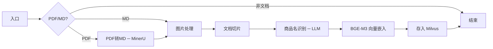
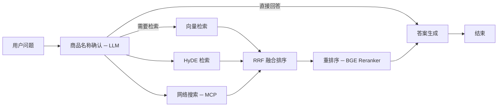

# 掌柜智库 (Knowledge_base_YunQi)

基于 **LangGraph + RAG** 架构的知识库问答系统，专为产品文档场景设计。支持 PDF/MD 文档的自动导入、向量化存储，以及基于自然语言的知识检索与答案生成。

---

## 系统架构

掌柜智库由两条核心流水线构成：

```
                   ┌──────────────────────────────────────────────────┐
                   │                    用户                          │
                   └────────┬──────────────┬──────────────────────────┘
                            │              │
                            ▼              ▼
              ┌────────────────────┐ ┌────────────────────┐
              │  导入服务 (8003)    │ │  查询服务 (8004)    │
              │  FastAPI           │ │  FastAPI + SSE     │
              └────────┬───────────┘ └────────┬───────────┘
                       │                      │
              ┌────────▼───────────┐ ┌────────▼───────────┐
              │  导入工作流          │ │  查询工作流          │
              │  (LangGraph)       │ │  (LangGraph)       │
              └────────┬───────────┘ └────────┬───────────┘
                       │                      │
                       ▼                      ▼
              ┌────────────────────┐ ┌────────────────────┐
              │  Milvus (向量库)    │ │  MongoDB (历史记录) │
              │  MinIO (对象存储)   │ │  Web Search (MCP)  │
              └────────────────────┘ └────────────────────┘
```

---

## 导入流程 (Import Pipeline)

将产品文档（PDF/MD）自动解析、切片、向量化，存入知识库。



### 节点说明

| 节点 | 功能 | 技术 |
|------|------|------|
| `a_node_entry` | 判断文件类型，路由到对应处理分支 | — |
| `b_node_pdf_to_md` | PDF 转 Markdown | MinerU API |
| `c_node_md_img` | 提取 Markdown 中的图片，上传 MinIO 并替换链接 | MinIO |
| `d_node_document_split` | 按层级结构（标题/段落）对文档切片 | 自定义分割策略 |
| `e_node_item_name_recognition` | 使用 LLM 识别文档中的产品/商品名称 | DashScope LLM |
| `f_node_bge_embedding` | 为切片生成稠密 + 稀疏向量 | BGE-M3 |
| `g_node_import_milvus` | 将切片与向量写入 Milvus 集合 | Milvus |

---

## 查询流程 (Query Pipeline)

用户提问后，经过商品确认、多路检索、融合排序、重排序，最终生成答案。



### 节点说明

| 节点 | 功能 | 技术 |
|------|------|------|
| `node_item_name_confirm` | 从问题中提取商品名称，路由检索策略 | DashScope LLM |
| `node_search_embedding` | 对原始问题进行向量检索 | Milvus + BGE-M3 |
| `node_search_embedding_hyde` | 先生成假设性文档，再向量检索（HyDE 策略） | LLM + Milvus |
| `node_web_search_mcp` | 通过网络搜索补充时效性信息 | DashScope MCP WebSearch |
| `node_rrf` | 对多路检索结果做 Reciprocal Rank Fusion 融合 | RRF 算法 |
| `node_rerank` | 对融合结果做精确重排序 | BGE Reranker |
| `node_answer_output` | 组装上下文与 Prompt，生成最终答案 | DashScope LLM + SSE |

---

## API 接口

### 导入服务 (`localhost:8003`)

| 方法 | 路径 | 说明 |
|------|------|------|
| `POST` | `/upload` | 上传文件（支持多文件），自动触发导入流程 |
| `GET` | `/status/{task_id}` | 查询任务处理进度（节点级实时状态） |
| `GET` | `/import.html` | 导入管理前端页面 |

### 查询服务 (`localhost:8004`)

| 方法 | 路径 | 说明 |
|------|------|------|
| `POST` | `/query` | 发起查询请求（支持流式/非流式） |
| `GET` | `/stream/{session_id}` | SSE 长连接，流式接收生成结果 |
| `GET` | `/history/{session_id}` | 获取会话历史记录 |
| `GET` | `/chat.html` | 聊天前端页面 |

---

## 技术栈

| 类别 | 技术 |
|------|------|
| 语言 | Python 3.11 |
| 框架 | FastAPI, LangGraph, LangChain |
| 向量库 | Milvus (PyMilvus) |
| 嵌入模型 | BGE-M3（稠密 + 稀疏向量） |
| 重排序 | BGE Reranker |
| 大语言模型 | DashScope（阿里云，兼容 OpenAI 格式） |
| 文档存储 | MongoDB |
| 对象存储 | MinIO |
| PDF 解析 | MinerU API |
| 网络搜索 | DashScope MCP WebSearch |
| 前端 | HTML（直接提供服务） |

---

## 快速开始

### 前置条件

- Python 3.11
- CUDA 兼容的 GPU（可选，用于加速嵌入与重排序）
- Milvus 服务（本地或远程）
- MongoDB 服务
- MinIO 对象存储
- MinerU API 访问令牌
- DashScope API 密钥

### 安装

```bash
# 创建虚拟环境
python -m venv kb311
source kb311/Scripts/activate

# 安装核心依赖
pip install fastapi uvicorn langgraph langchain-core
pip install pymilvus transformers FlagEmbedding
pip install python-dotenv
```

### 配置

复制环境变量模板并填写：

```bash
cp .env.example .env
```

参考 `.env.example` 中的字段说明配置各项服务地址与密钥。

### 启动

```bash
# 启动导入服务（端口 8003）
python web/api/import_service.py

# 启动查询服务（端口 8004）
python web/api/query_service.py
```

---

## 项目结构

```
knowledge/
├── config/                            # 配置层（从 .env 读取）
│   ├── embedding_config.py            # BGE 嵌入模型配置
│   ├── lm_config.py                   # LLM 配置
│   ├── milvus_config.py               # Milvus 向量库配置
│   ├── minio_config.py                # MinIO 对象存储配置
│   ├── mineru_config.py               # MinerU PDF 解析配置
│   └── reranker_config.py             # 重排序模型配置
│
├── processor/                         # 业务处理流水线（LangGraph）
│   ├── import_processor/              # 导入工作流
│   │   ├── main_graph.py              # 流程图定义
│   │   ├── state.py                   # 状态类型定义
│   │   ├── base.py                    # 基类
│   │   ├── exceptions.py              # 异常定义
│   │   └── node/                      # 导入节点
│   │       ├── a_node_entry.py
│   │       ├── b_node_pdf_to_md.py
│   │       ├── c_node_md_img.py
│   │       ├── d_node_document_split.py
│   │       ├── e_node_item_name_recognition.py
│   │       ├── f_node_bge_embedding.py
│   │       └── g_node_import_milvus.py
│   │
│   └── query_processor/               # 查询工作流
│       ├── main_graph.py              # 流程图定义
│       ├── state.py                   # 状态类型定义
│       ├── base.py                    # 基类
│       ├── exceptions.py              # 异常定义
│       ├── prompt.py                  # 提示词模板
│       └── nodes/                     # 查询节点
│           ├── node_item_name_confirm.py
│           ├── node_search_embedding.py
│           ├── node_search_embedding_hyde.py
│           ├── node_web_search_mcp.py
│           ├── node_rrf.py
│           ├── node_rerank.py
│           └── node_answer_output.py
│
├── web/                               # API 服务层
│   ├── api/
│   │   ├── import_service.py          # 导入路由（FastAPI）
│   │   └── query_service.py           # 查询路由（FastAPI + SSE）
│   └── page/                          # 前端页面
│       ├── import.html                # 导入管理界面
│       └── chat.html                  # 聊天界面
│
├── utils/                             # 工具函数
│   ├── embedding_utils.py             # BGE-M3 嵌入封装
│   ├── milvus_utils.py                # Milvus 操作工具
│   ├── minio_utils.py                 # MinIO 操作工具
│   ├── mongo_history_utils.py         # MongoDB 历史记录
│   ├── reranker_http_utils.py         # 重排序 HTTP 客户端
│   ├── sse_utils.py                   # SSE 流式推送
│   ├── task_utils.py                  # 任务状态管理
│   └── llm_utils.py                   # LLM 调用封装
│
├── test/                              # 测试代码
├── .env.example                       # 环境变量模板
└── README.md
```

---

## 检索策略

系统采用 **多路检索 + 融合重排序** 策略，兼顾检索的广度与精度：

1. **稠密向量检索** — 用 BGE-M3 对原始问题编码，检索语义相似切片
2. **HyDE 检索** — 先用 LLM 将问题扩展为假设性文档，再做向量检索，改善查全率
3. **网络搜索** — 通过 DashScope MCP 获取互联网最新信息，补全知识库盲区
4. **RRF 融合** — 对三路结果做 Reciprocal Rank Fusion，综合排序
5. **BGE Re-rank** — 最终用交叉编码器对 Top-K 结果做精确重排序，提升排序质量

---

## 许可证

本项目仅供学习参考使用。
